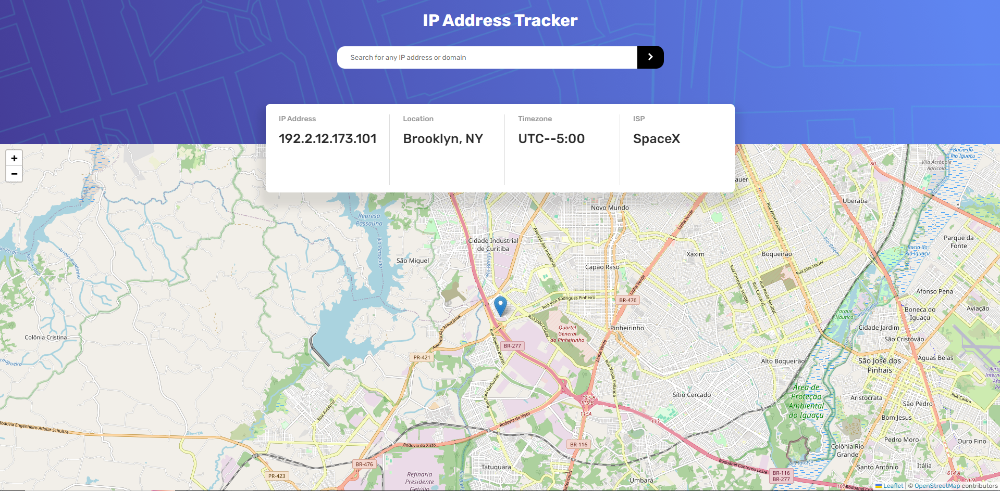

## Frontend Mentor - IP Address Tracker Solution

This is my solution to the [IP address tracker challenge on Frontend Mentor](https://www.frontendmentor.io/challenges/ip-address-tracker-I8-0yYAH0). Frontend Mentor challenges are a great way to enhance your coding skills by building realistic projects.

## Table of Contents

- [Overview](#overview)
  - [The Challenge](#the-challenge)
  - [Screenshot](#screenshot)
  - [Links](#links)
- [My Process](#my-process)
  - [Built With](#built-with)
  - [What I Learned](#what-i-learned)
  - [Continued Development](#continued-development)
  - [Useful Resources](#useful-resources)
- [Author](#author)

## Overview

### The Challenge

Users should be able to:

- View the optimal layout for each page depending on their device's screen size.
- See hover states for all interactive elements on the page.
- See their own IP address on the map on the initial page load.
- Search for any IP addresses or domains and see the key information and location.

### Screenshot

### Links

- Solution URL: (https://gabrielth58.github.io/IP-Address-Tracker/)

## My Process

### Built With

- Semantic HTML5 markup
- CSS custom properties
- Flexbox
- Mobile-first workflow
- JavaScript

### What I Learned

During this project, I gained experience working with multiple APIs to fetch and display IP address information dynamically.

### Continued Development

In future projects, I aim to further refine my skills in JavaScript and explore more advanced techniques in front-end development.

### Useful Resources

- [Leaflet.js Documentation](https://leafletjs.com)
- [IP Geolocation API Documentation](https://geo.ipify.org/docs) - These API documents provided valuable insights into implementing them in my code.

## Author

- Frontend Mentor - [@GabrielTh58](https://www.frontendmentor.io/profile/GabrielTh58)
